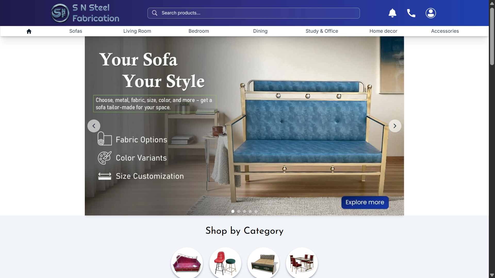
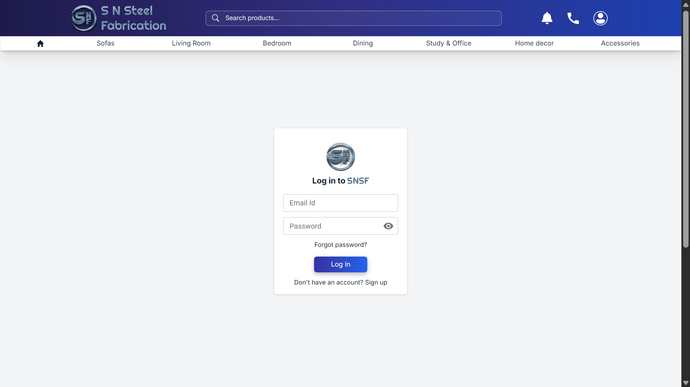
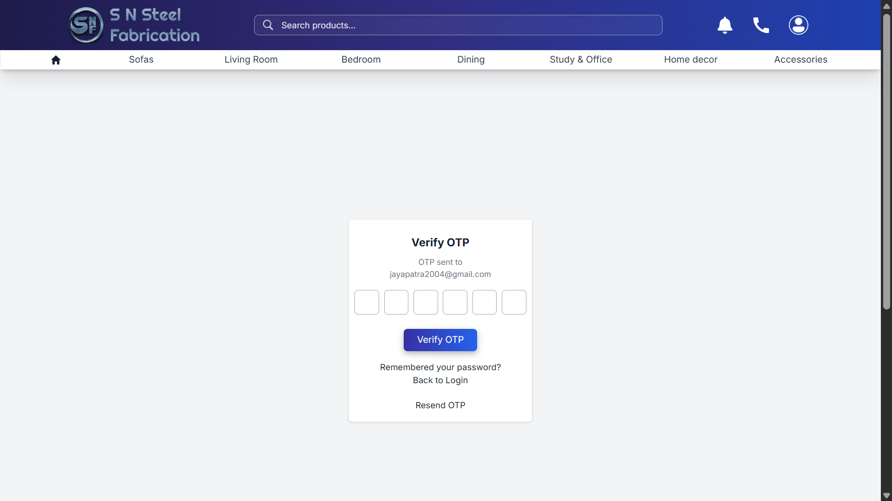
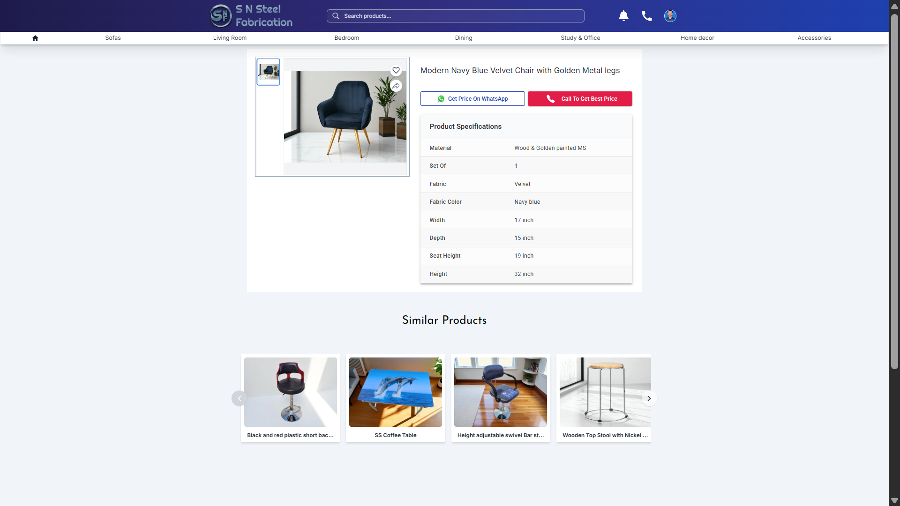
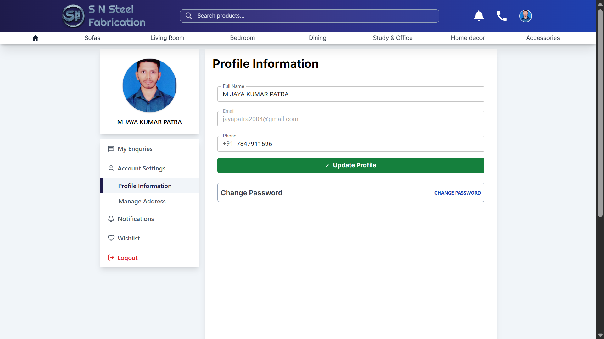
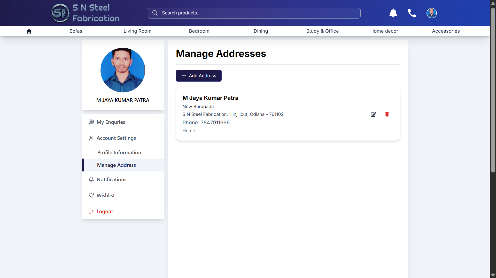
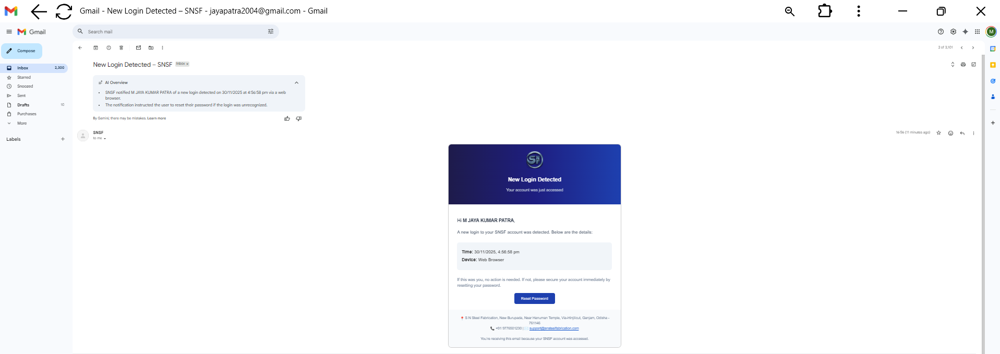
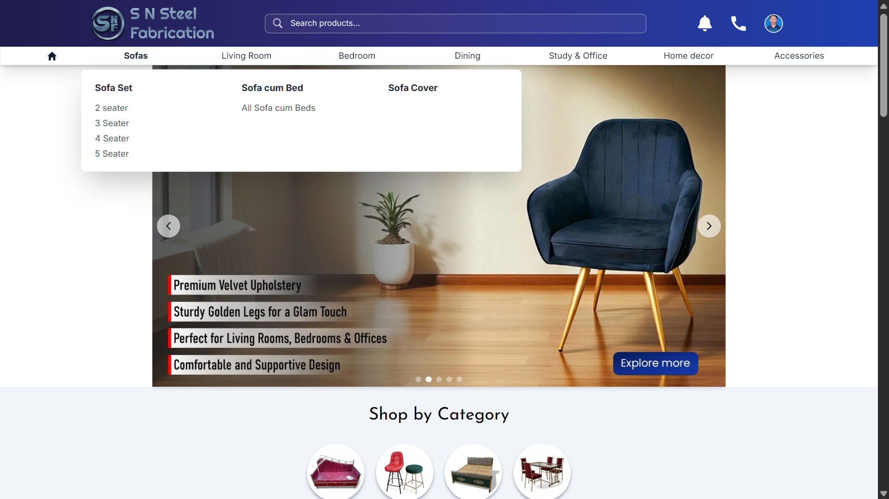

# 🎉 SNSF – Steel Furniture E-commerce Platform

A full-stack e-commerce platform built for **S N Steel Fabrication**, a real steel furniture manufacturing business.  
This system includes a **customer-facing website** and a **complete admin dashboard** with product management, orders, and authentication.

🔗 **Live Website:** [snsteelfabrication.com](https://snsteelfabrication.com)

---

## 🚀 Features

### ⭐ Customer Website
- Browse products by category, subcategory, and filters
- Detailed product pages with images & specifications
- Add to cart and complete checkout flow
- Fully responsive design (mobile + desktop)
- SEO-friendly pages powered by **Next.js**
- **Resend verification email** functionality implemented for authentication flows

### ⭐ Admin Dashboard
- Secure admin authentication
- Add / Edit / Delete products
- Manage categories & subcategories
- **Cloudinary-based image upload & optimization**
- Order and delivery status management
- Dynamic product specifications support
- **Icons integrated using MUI & React Icons** for better UI/UX  
  Example: 🛒 Cart icon, ✏️ Edit icon, 🗑️ Delete icon

### ⭐ Backend API
- RESTful API using **Express.js**
- **MongoDB** database with **Mongoose**
- JWT authentication
- Protected admin routes
- Image storage & optimization with Cloudinary

---

## 🛠️ Tech Stack

**Frontend:** Next.js, React.js, MUI, Tailwind CSS, React Icons  
**Backend:** Node.js, Express.js, MongoDB (Mongoose)  
**Cloud & Tools:** Cloudinary, Vercel, MongoDB Atlas, GitHub, Postman  
**Other:** JWT Auth, REST APIs, SDLC practices, Agile workflow  

---

## 🎯 Highlights
- Real-world, production-ready e-commerce application
- Developed end-to-end: frontend, backend, database, and deployment
- Deployed on **Vercel** with a cloud database on **MongoDB Atlas**
- Designed UI for accessibility and consistent multi-device experience
- Includes a complete admin dashboard for business operations

---

## 🖼️ screenShots

### Customer Website Screens

#### Homepage

#### Login Page

#### Forgot Password

#### Product Page

#### Profile Page

#### Wishlist Page

#### Shop By Category

#### Search

#### Footer

#### Address Section

#### Email Section

#### Logout Modal

#### Profile Popup

#### Sub Menu

---

## 👨‍💻 Author
**M Jaya Kumar Patra**  
B.Tech IT • Full-Stack Developer  
GitHub: [M-Jaya-Kumar-Patra](https://github.com/M-Jaya-Kumar-Patra)  
Email: jayapatra2004@gmail.com  

---

⭐ **Support**  
If you find this project interesting, consider giving it a **star ⭐** on GitHub!
